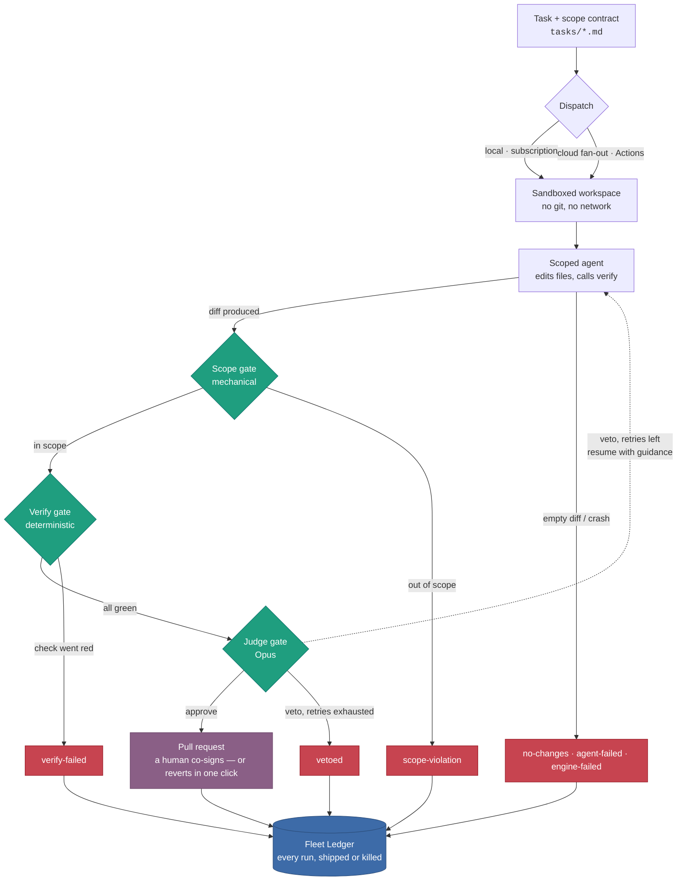
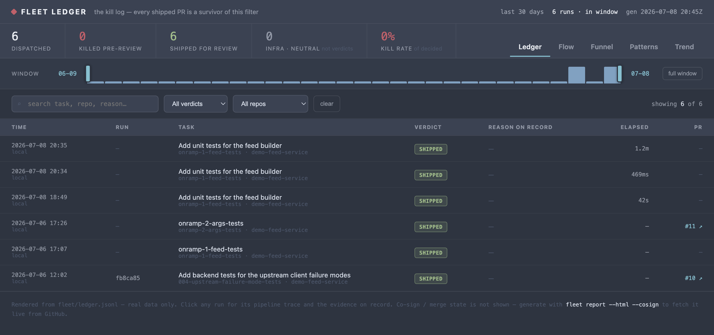

# spotify-stack — a Honk-style background coding agent fleet

A reference implementation of Spotify's **Honk** background coding agent
(engineering blog, [part 1](https://engineering.atspotify.com/2025/11/spotifys-background-coding-agent-part-1),
[part 2](https://engineering.atspotify.com/2025/11/context-engineering-background-coding-agents-part-2),
[part 3](https://engineering.atspotify.com/2025/12/feedback-loops-background-coding-agents-part-3),
[part 4](https://engineering.atspotify.com/2026/4/background-coding-agents-dataset-migrations-honk-part-4)),
built entirely from public building blocks: Claude Code headless mode, MCP,
Claude Code hooks + permission allowlists, the Anthropic SDK, and GitHub
Actions.

Version-controlled natural-language **task prompts** fan out across a fleet
of repos. Each repo gets a **constrained headless Claude Code run**;
**auto-detected deterministic verifiers** (exposed as an MCP tool and enforced
by a Stop hook) plus an **LLM-as-judge** gate the result; the **runner — never
the agent — opens the PR**.

**New to the fleet — or skeptical of it?** Start here → [ONRAMP.md](ONRAMP.md):
watch a dry run, co-sign one PR, do the revert drill, read the kill log.

## How a run flows

A task descends through a gauntlet of **mechanical gates**. Each gate can kill
the run — with its reason recorded — *before any human sees it*. What survives
arrives as a pre-verified pull request to co-sign, not a rough draft to audit.



Two invariants hold it together: the agent can only *propose* (the runner owns
git, so a killed run leaves nothing to unwind), and every gate kills before
review (a person only ever co-signs pre-verified diffs).

## Architecture ↔ blog mapping

| Honk concept (blog part) | Here |
|---|---|
| Fleet Management / Fleetshift fan-out (1, 4) | [`fleet/repos.yaml`](fleet/repos.yaml) + `fleet` CLI + [`fleet-run.yml`](.github/workflows/fleet-run.yml) matrix |
| Internal CLI wrapping the agent (1) | [`packages/runner`](packages/runner) spawning `claude -p --output-format json` |
| Version-controlled prompts, six practices (2) | [`tasks/TEMPLATE.md`](tasks/TEMPLATE.md) + [`tasks/examples/`](tasks/examples) — end state, preconditions (`NO_CHANGES_NEEDED` sentinel), before/after examples, verifiable goal, atomic scope |
| Constrained toolkit (2) | [`agent-config/settings.json`](agent-config/settings.json) allowlist: file edits, read/search, `rg`/`ls`, the `verify` MCP tool. No git, no network — the runner owns branch/commit/push/PR |
| Verify tool via MCP, auto-detected verifiers (3) | [`packages/mcp-verify`](packages/mcp-verify) — `package.json` → lint/typecheck/test, `Package.swift` → `swift build`/`swift test`; output regex-summarized to ~4 KB |
| Stop-hook pre-completion validation (3) | [`agent-config/hooks/stop-verify.mjs`](agent-config/hooks/stop-verify.mjs) — exit 2 + summary blocks the agent from finishing red (bounded at 3 blocks) |
| LLM-as-judge with veto/self-correct loop (3) | [`packages/judge`](packages/judge) — `claude-opus-4-8`, structured-output verdict; veto → `claude -p --resume` with guidance, max 2 retries |
| Background execution (1) | [`agent-task.yml`](.github/workflows/agent-task.yml) / [`fleet-run.yml`](.github/workflows/fleet-run.yml) on `workflow_dispatch`; `--local` mode for development |
| Observability (1) | transcripts, `verdict.json`, `verify.log`, `diff.patch` per run under `artifacts/`, uploaded as Actions artifacts; `fleet status` markdown table; the **[Fleet Ledger](#the-fleet-ledger)** (`fleet/ledger.jsonl` → `fleet report`) — every run shipped or killed, as text, HTML, or a live dashboard |
| Dataset-migration shape (4) | Each demo repo pairs a deprecated module with its replacement, so migration tasks have crisp preconditions and a deterministic green/red signal |

## The runner loop

```
clone/copy repo → inject .claude/ config → assemble prompt from tasks/*.md
   → claude -p (Stop hook re-runs verify inside the session until green)
   → NO_CHANGES_NEEDED? → report, stop
   → belt-and-braces runVerify()          — red → fail, no PR
   → judge(task, diff, verify summary)    — veto → resume session w/ guidance (≤2)
   → approve → runner branches, commits, pushes, `gh pr create`
     (default is --dry-run: diff + verdict written to artifacts/ instead)
```

Key invariant (Spotify's "predictability over flexibility"): the agent process
can only edit files and call `verify`. Everything with side effects beyond the
worktree lives in the runner.

## Layout

```
packages/cli         fleet run / dispatch / status
packages/runner      per-repo loop (workspace, engines, judge loop, PR)
packages/mcp-verify  verifier detection + summarizers + MCP server + CLI (plain JS)
packages/judge       LLM-as-judge (@anthropic-ai/sdk, zod structured output)
agent-config/        settings.json allowlist, MCP config, Stop hook templates
tasks/               TEMPLATE.md + example migration tasks
fleet/repos.yaml     target-repo registry
demo-repos/          demo-ts-service, demo-swift-package, demo-feed-service (fleet targets)
scripts/             bootstrap-github.sh + workflow helpers
```

## Prerequisites

- **Node ≥ 20** and **pnpm** (`corepack enable pnpm`) — all the quickstart needs.
- **[Claude Code](https://claude.com/claude-code)** (`claude`) installed and logged
  in — for live runs (the default `--engine claude`) and the local default
  `--judge cli`.
- **[GitHub CLI](https://cli.github.com)** (`gh`) logged in — only for `--pr`,
  `fleet dispatch`/`status`, and `report --cosign`.

## Quickstart (no credentials needed)

```sh
corepack enable pnpm && pnpm install
git config core.hooksPath .githooks   # enable the pre-commit scrub check (see below)
pnpm test               # unit + hermetic e2e (real eslint/tsc/vitest in temp workspaces)

# Full loop with the mock engine — applies a fixture patch instead of Claude:
pnpm fleet run 001-ts-migrate-http-client --repo demo-ts-service --local \
  --engine mock --mock-patch packages/runner/test/fixtures/001-good.patch --judge approve
cat artifacts/001-ts-migrate-http-client/demo-ts-service/diff.patch
```

### The scrub check

This repo is public, and your fleet targets are not: they live only in the
git-ignored `fleet/repos.local.yaml` and `tasks/private/`. `fleet/ledger.jsonl`
is trickier — it *is* tracked, but every local run appends lines naming the repos
you ran against, so it's held back with `git update-index --skip-worktree`.

`scripts/check-scrub.sh` keeps that honest. `git config core.hooksPath .githooks`
points git at the committed hook that runs it over your staged changes, rejecting
a commit that would publish a private target's name. Git has no way to enable a
hook on clone, so this step is manual and worth doing before your first commit.
CI runs the same script over `HEAD` (`pnpm scrub`), which is the backstop.

Add your own banned terms to the `IDENTIFIERS` list at the top of the script.

## Live local run (Claude Code credentials)

```sh
# real agent, stubbed judge:
pnpm fleet run 001-ts-migrate-http-client --repo demo-ts-service --local --judge approve
# real agent + real judge, both on your Claude subscription (local default --judge cli, no API key):
pnpm fleet run 001-ts-migrate-http-client --repo demo-ts-service --local
```

Dry-run is the default everywhere — add `--pr` to push a branch and open a PR.

### Run against your own repo (local)

`--local` sources from a repo's `local_path` (falling back to
`demo-repos/<name>`), so you can point the fleet at your own working tree with no
copying. Add a `local_path` to the `fleet/repos.yaml` entry — it takes a leading
`~` and any `${ENV_VAR}`, and relative paths resolve against the control repo:

```yaml
  - name: my-repo
    url: https://github.com/${GH_OWNER}/my-repo
    language: typescript
    default_branch: main
    local_path: ~/dev/my-repo   # local runs copy from here
```

```sh
pnpm fleet run <task> --repo my-repo --local --judge approve
```

Local mode runs the agent against the working tree at `local_path` (that's the
point — you can test uncommitted work). So before running a task that depends on
a just-merged PR, `git pull` that tree first, or the task will see stale code and
hit its own precondition (`NO_CHANGES_NEEDED`).

Keep your own project out of this shared control repo with two git-ignored
overlays:

- **Private targets** → `fleet/repos.local.yaml` (same schema as `repos.yaml`;
  merged on load, overriding by name). Put the `my-repo` entry above there instead
  of in `repos.yaml`.
- **Private task prompts** → **`tasks/private/`** (see
  [`tasks/private/README.md`](tasks/private/README.md)); the CLI resolves a bare
  task id there too.

So `pnpm fleet run <id> --repo my-repo --local` works with nothing project-specific
committed. The `fleet/ledger.jsonl` run history is still recorded either way.

Two things to check before the first run against a new repo:

- **Know what the verify gate will run.** Verification auto-detects checks from
  the workspace: with a `package.json` it runs `npm run test`, plus `npm run lint`
  and `npm run typecheck` (or `tsc --noEmit` with a tsconfig) when those scripts
  exist; a `Package.swift` gets `swift build` + `swift test`. A repo with none of
  these **passes vacuously** — no gate at all, so the judge is your only check.
  Confirm the detected commands run green standalone before dispatching a task.
- **No tests yet? Start with a tests-first on-ramp.** Make the first task
  establish the test harness and cover the purest core module, so every later
  task has a verifier gate to clear. The [`tasks/onramp/`](tasks/onramp/) prompts
  are the model for this pattern.

### GitHub Actions is optional

The Actions workflows are a thin wrapper around the same CLI — the whole loop
(clone → agent → verify → judge → PR) runs on any machine with `claude` and
`gh` logged in. Drop `--local` to clone a real repo from `fleet/repos.yaml`:

```sh
# GH_OWNER is optional — the CLI derives it from `gh api user` when unset
# (export it to override).
pnpm fleet run 004-upstream-failure-mode-tests --repo demo-feed-service --pr --judge approve
```

Why run locally — cost:

- The agent is your local `claude` session, billed to your **Claude
  subscription** — cloud runs spawn `claude` with `ANTHROPIC_API_KEY`, which
  burns pay-as-you-go API credits (roughly $1–5 per run; a judge veto→retry
  loop multiplies it).
- The LLM judge is the only other model call. Locally it defaults to `--judge
  cli` (the `claude` CLI on your subscription — no API key, no credits); CI uses
  the SDK judge against `ANTHROPIC_API_KEY`. `--judge approve` skips it entirely —
  you become the judge when you review the PR.
- GitHub Actions minutes are the minor cost (~16 min per run against a
  2,000-min/month free tier for private repos).

What the cloud runtime actually buys you is fan-out and autonomy: `fleet
dispatch` matrixes one task over every target repo, on infrastructure that
doesn't depend on your laptop. Iterate on tasks locally; use Actions when you
scale out.

## The Fleet Ledger

Every run — shipped or killed — is appended to `fleet/ledger.jsonl` (title, sha,
timings, evidence, and the kill reason when a gate stopped it). `fleet report`
reads it back: the fleet's own record of what it *stopped before anyone reviewed
it*, not just what it shipped. That kill log is what makes the successes mean
something.

[](docs/fleet-ledger.png)

```sh
pnpm fleet report                     # text: shipped/killed tally + kill log with reasons
pnpm fleet report --html              # render the Fleet Ledger v2 as a self-contained page
pnpm fleet report --html --cosign     # …and fetch live PR merge state from GitHub (needs gh)
pnpm fleet report --serve --open      # live dashboard, auto-reloads as runs land, opens your browser
pnpm fleet report --serve --cosign    # live dashboard + poll GitHub merge state every 60s
```

The HTML/live views render the full Fleet Ledger design — Ledger / Flow /
Funnel / Patterns / Trend tabs and a 14-day trend; `--cosign` merges in each shipped PR's live state
(open / merged / closed, and who co-signed it), which the ledger can't know on
its own. Other flags: `--days <n>` (window, default 30), `--out <path>`
(HTML output, default `artifacts/ledger.html`), `--port <n>` (serve port,
default 4173). The report regenerated after each run stays offline — co-sign
polling only happens when you ask for it.

The co-sign itself — the human decision on a shipped run — can be executed
from the CLI instead of the GitHub UI:

```sh
pnpm fleet cosign <runId> --merge                      # squash-merge the run's PR, delete the branch
pnpm fleet cosign <runId> --close --reason "why"       # close it; the reason lands as a PR comment
```

`<runId>` comes from the ledger (`fleet report`). The merge is **ledger-gated
on this machine**: it refuses — with a structured, named reason — unless the
run shipped from here (`approved`, local, PR opened) and GitHub reports the PR
open and cleanly mergeable. There is deliberately no `--force`; a refusal is
the gate working. `--json` emits the result (including refusals and the merge
receipt: squash sha, merged-by, merged-at) for machine consumers like the
desktop operator. Nothing new is written to the ledger — GitHub stays the
source of truth for co-sign state, which `--cosign` polling picks up.

### Optional desktop operator

`apps/operator-desktop` is a macOS-first Tauri shell over the same CLI and
ledger server. It does not directly clone repos, write artifacts, make git
changes, or open pull requests; a dispatched CI run or a runner-side local run
may still open a PR through the runner. One managed SSH process starts
`fleet report --serve` on the runner and forwards its loopback port to an
available local port; dispatch actions run separately as fixed `fleet dispatch`
or `fleet run --local` commands over SSH. The launch form's PR toggle (default
on) adds the fixed `--pr` flag to the local-run command, so runs launched from
the app produce reviewable PRs by default; unticking it keeps the
artifacts-only dry run.

The runner machine must already have this control repo installed and be able to
run `pnpm fleet`. The Mac uses its existing OpenSSH agent/keychain; the app does
not read or store SSH private keys or GitHub tokens.

Connections are non-interactive (`ssh -o BatchMode=yes` with no stdin). Before
using a profile, accept the host key once, load the key into the operator Mac's
agent/keychain, and verify:

```sh
ssh -o BatchMode=yes <target> true
ssh <target> 'command -v node && command -v pnpm'
ssh <target> 'cd /absolute/path/to/control-repo && pnpm fleet report --days 1'
ssh -o BatchMode=yes <target> 'cd /absolute/path/to/control-repo && gh auth status'
```

The last check backs the in-app co-sign actions: `fleet cosign` runs `gh` on
the runner, so `gh auth status` must succeed over the same non-interactive SSH
channel — the shell is non-login, so the `gh` binary and its token must be
reachable from `~/.zshenv`, not only from an interactive profile. The token
needs write access on the target repos (already true wherever PR creation
works). Verify this once per profile during setup, not during your first merge.

```sh
# Rust is only required for the optional desktop shell.
pnpm install
pnpm operator
```

Create a host profile with an SSH target (`user@host` or an SSH config alias),
the absolute path to the remote control repo, and the remote ledger port
(default `4173`). The command prefix is derived as
`cd -- <remote-repo> && exec pnpm fleet`; it is displayed but cannot be replaced
with arbitrary shell. Profiles contain no secrets and are stored in Tauri's
application-data directory.

The live server continues to bind to `127.0.0.1`. In addition to the existing
dashboard and `/events` stream, it exposes read-only operator data under:

| Endpoint | Data |
|---|---|
| `/api/catalog` | task and target-repo selectors |
| `/api/ledger` | completed ledger entries |
| `/api/inflight` | live runner state |
| `/api/runs/:runId` | one completed or in-flight run plus artifact metadata |
| `/api/artifacts/:task/:repo` | allowlisted artifact metadata |
| `/api/artifacts/:task/:repo/:file` | safe review artifacts only |

Artifact reads are limited to `diff.patch`, `verify.log`, `verdict.json`,
`result.json`, and `pr-preview.md` beneath the configured `artifacts/` root.
Traversal, symlink escapes, transcripts, and unknown files are rejected.

Cloud synchronization is not automatic in v1. Actions commits ledger lines to
`origin/main` and stores artifacts in Actions, while the server reads the runner
machine's local checkout and `artifacts/`. Until a runner-owned sync command is
added, refresh the runner checkout/cache separately; dispatched cloud
completions and artifacts will not appear merely because dispatch was accepted.

## Cloud runbook (GitHub Actions)

1. `./scripts/bootstrap-github.sh` — creates + pushes the three demo repos,
   creates this control repo's remote, sets the `ANTHROPIC_API_KEY` secret.
2. Create `FLEET_GH_TOKEN` (fine-grained PAT: Contents + Pull requests
   read/write on the three demo repos) — the script prints the exact steps.
3. ```sh
   export GH_OWNER=<your github login>
   pnpm fleet dispatch 003-add-agent-badge     # matrix over the whole fleet
   pnpm fleet status 003-add-agent-badge       # runs + PRs as a markdown table
   ```
4. Negative path: dispatch `001` after merging it once — the precondition
   makes the agent report `NO_CHANGES_NEEDED` and no PR opens. The judge veto
   path is covered hermetically in `packages/runner/test/e2e.test.ts`.

## Verification map

| Level | What | Where |
|---|---|---|
| Unit | summarizer fixtures (real captured eslint/tsc/vitest/swift failures), judge verdict parsing, task frontmatter | `pnpm test` |
| Hermetic e2e | full loop: workspace → config injection → mock edit → **real** verifiers → stubbed judge → dry-run artifacts; negative (verify red), veto/self-correct, veto-exhausted, `NO_CHANGES_NEEDED`; Stop hook exit-2 protocol | `packages/runner/test/e2e.test.ts` (also runs in [`ci.yml`](.github/workflows/ci.yml)) |
| Live local | same loop, `--engine claude` | command above |
| Cloud | `fleet dispatch` → Actions matrix → PRs + artifacts | runbook above |

## Ad-hoc entry: issue → task (part 4)

Label a GitHub issue `agent-task` and
[`agent-plan.yml`](.github/workflows/agent-plan.yml) turns it into a fleet
task: a planning agent — fenced like the coding agent, read/write only, no
Bash or network — reads the issue plus
[the prompt](.github/prompts/plan-issue.md) and `tasks/TEMPLATE.md`, and
writes `tasks/issue-<n>-<slug>.md`. The workflow mechanically enforces that
exactly one task file was written (or an explicit `NOT_A_TASK` decline),
validates it (`scripts/validate-task.ts`), and opens a PR linked back to the
issue. A human reviews and merges the *task*, then dispatches it — planning
output gets the same co-sign treatment as code.
