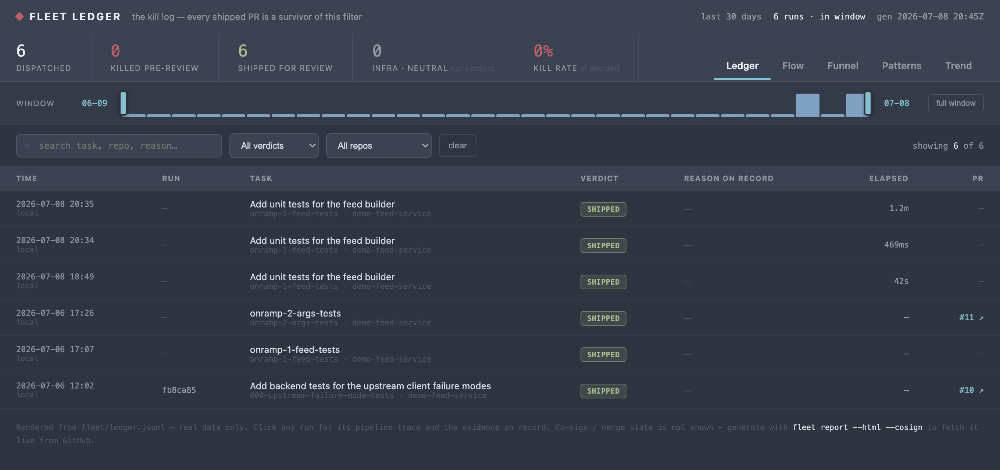

<div align="center">

<picture>
  <source media="(prefers-color-scheme: dark)" srcset="docs/brand/hero-dark.svg">
  
</picture>

<br>

**Designed for anyone who has to co-sign what an agent wrote.**
<br>Tuned for the coding agents you already run.

<br>

[](#start-in-60-seconds)
[](docs/README.md)
[](docs/adr)

<sub>Runs anywhere Node ≥ 20 does &nbsp;·&nbsp; one repo per run &nbsp;·&nbsp; dry-run by default &nbsp;·&nbsp; MIT</sub>

<br>

[](../../actions/workflows/ci.yml)
[](LICENSE)


</div>

<br>

<picture>
  <source media="(prefers-color-scheme: dark)" srcset="docs/brand/divider-dark.svg">
  
</picture>

<br>

<div align="center">

## Most agent fleets show you what they shipped.

### The interesting number is the other one.

</div>

[](docs/fleet-ledger.png)

<div align="center">

<sub>Every run — shipped <b>or killed</b> — lands in <code>fleet/ledger.jsonl</code> with the gate that stopped it and why.</sub>

<br><br>

A run can die three ways. Every one of them happens **before a human opens the diff**.

</div>

| | Kill reason | What it means |
|:--:|---|---|
| ⛔ | `scope-violation` | The diff touched files the task's scope contract didn't allow. |
| 🔴 | `verify-failed` | A deterministic check the repo already had went red. |
| ⚪ | `no-changes` | The precondition was already satisfied. Correctly doing nothing. |

```sh
pnpm fleet report          # the tally, and the kill log with reasons
```

<br>

<picture>
  <source media="(prefers-color-scheme: dark)" srcset="docs/brand/divider-dark.svg">
  
</picture>

<br>

<div align="center">

## Ship faster, review less.

Write the task once, in plain English. Run it against a target.
<br>What reaches you is a verified pull request to co-sign — not a rough draft to audit.

</div>

<br>

<table>
<tr>
<td width="33%" align="center"><br><b>The agent is caged</b><br><br><sub>File edits, read/search, and one <code>verify</code> tool. No git. No network. No shell beyond the allowlist.</sub></td>
<td width="33%" align="center"><br><b>Verification is tri-state</b><br><br><sub><code>passed</code> · <code>failed</code> · <code>unverifiable</code>. Never a boolean. A false green is the one output this system may not produce.</sub></td>
<td width="33%" align="center"><br><b>Nothing goes unrecorded</b><br><br><sub>Shipped or killed, every run is appended with its reason. The kill log is what makes the successes mean something.</sub></td>
</tr>
<tr>
<td width="50%" align="center"><br><b>A human always co-signs</b><br><br><sub>Every shipped run ends at a PR a person merges — or reverts in one click. <code>cosign</code> has no <code>--force</code>.</sub></td>
<td width="50%" align="center"><br><b>Runs on your subscription</b><br><br><sub>The whole loop runs locally against your Claude session. No API key needed to start.</sub></td>
</tr>
</table>

<br>

<picture>
  <source media="(prefers-color-scheme: dark)" srcset="docs/brand/divider-dark.svg">
  
</picture>

<br>

<div align="center">

## Start in 60 seconds.

No credentials. No API key. The full loop, against a mock engine.

</div>

```sh
corepack enable pnpm && pnpm install
git config core.hooksPath .githooks   # enable the public-repo scrub hook

pnpm test    # unit + hermetic e2e — real eslint, tsc and vitest in temp workspaces

pnpm fleet run tasks/examples/001-ts-migrate-http-client.md --repo demo-ts-service --local \
  --engine mock --mock-patch packages/runner/test/fixtures/001-good.patch

cat artifacts/001-ts-migrate-http-client/demo-ts-service/diff.patch
```

<div align="center"><sub>Then the real thing, on your Claude subscription:</sub></div>

```sh
pnpm fleet run tasks/examples/001-ts-migrate-http-client.md --repo demo-ts-service --local
```

<div align="center">

**Dry-run is the default for every command in this repo.** Opening a PR requires typing `--pr`.

</div>

<br>

<picture>
  <source media="(prefers-color-scheme: dark)" srcset="docs/brand/divider-dark.svg">
  
</picture>

<br>

<div align="center">

## Don't trust it. Check it.

[**`ONRAMP.md`**](ONRAMP.md) is written for the skeptic.

</div>

<table>
<tr>
<td width="25%" align="center"><b>1 · Watch it do nothing</b><br><br><sub>A dry run that produces no PR, on purpose.</sub></td>
<td width="25%" align="center"><b>2 · Co-sign exactly one PR</b><br><br><sub>One diff. Read every line of it.</sub></td>
<td width="25%" align="center"><b>3 · Do the revert drill</b><br><br><sub>Prove to yourself the undo is one click.</sub></td>
<td width="25%" align="center"><b>4 · Read the kill log</b><br><br><sub>Then decide for yourself.</sub></td>
</tr>
</table>

<br>

<picture>
  <source media="(prefers-color-scheme: dark)" srcset="docs/brand/divider-dark.svg">
  
</picture>

<br>

<div align="center">

## Every invariant, a decision away.

Four boundaries carry the design weight.
<br>Each has an ADR behind it, carrying the option that lost.

</div>

| Invariant | Decision |
|---|---|
| The agent proposes; the runner does everything with a side effect. | [ADR-0003](docs/adr/0003-the-runner-owns-git.md) |
| Verification is a tri-state; a false green is forbidden. | [ADR-0004](docs/adr/0004-verification-tri-state-and-mandated-gates.md) |
| Every wire shape is declared once, beside the code that writes it. | [ADR-0027](docs/adr/0027-the-wire-contract-package-is-deleted.md) |
| `fleet cosign` has no `--force`. A refusal is the gate working. | [ADR-0005](docs/adr/0005-operator-drives-the-cli-over-ssh.md) |

<div align="center">

<sub><b>A new agent capability is a cage change, not a feature.</b> &nbsp;·&nbsp; <a href="docs/adr">All 27 decisions →</a></sub>

</div>

<br>

<picture>
  <source media="(prefers-color-scheme: dark)" srcset="docs/brand/divider-dark.svg">
  
</picture>

<br>

<div align="center">

## The human decision, a shortcut away.

<kbd>report</kbd> &nbsp; <kbd>cosign --merge</kbd> &nbsp; <kbd>cosign --close</kbd>

</div>

```sh
pnpm fleet report --serve --open                  # live dashboard, auto-reloads
pnpm fleet cosign <runId> --merge                 # squash-merge, delete branch
pnpm fleet cosign <runId> --close --reason "why"  # the reason lands as a comment
```

<div align="center">

<sub><code>cosign --merge</code> is ledger-gated on the machine that ran it: it refuses, with a named reason,<br>unless this machine shipped the run and GitHub reports the PR open and cleanly mergeable.</sub>

</div>

<br>

<picture>
  <source media="(prefers-color-scheme: dark)" srcset="docs/brand/divider-dark.svg">
  
</picture>

<br>

<div align="center">

## Also, plays well with agents.

It is one. This repo is a reference implementation of Spotify's **Honk**, built entirely from public parts.

<sub>Claude Code headless mode &nbsp;·&nbsp; MCP &nbsp;·&nbsp; hooks and permission allowlists &nbsp;·&nbsp; the Anthropic SDK &nbsp;·&nbsp; GitHub Actions &nbsp;·&nbsp; Tauri</sub>

<sub>Mapped to the blog series: <a href="https://engineering.atspotify.com/2025/11/spotifys-background-coding-agent-part-1">part 1</a> · <a href="https://engineering.atspotify.com/2025/11/context-engineering-background-coding-agents-part-2">part 2</a> · <a href="https://engineering.atspotify.com/2025/12/feedback-loops-background-coding-agents-part-3">part 3</a> · <a href="https://engineering.atspotify.com/2026/4/background-coding-agents-dataset-migrations-honk-part-4">part 4</a></sub>

</div>

<br>

<picture>
  <source media="(prefers-color-scheme: dark)" srcset="docs/brand/divider-dark.svg">
  
</picture>

<br>

<div align="center">

## Want the whole thing?

</div>

<table>
<tr>
<td width="33%" valign="top">

**Product**

[Quickstart](#start-in-60-seconds)
[On-ramp](ONRAMP.md)
[Run against your repo](docs/README.md)
[The Fleet Ledger](#most-agent-fleets-show-you-what-they-shipped)

</td>
<td width="33%" valign="top">

**Understand**

[Docs map](docs/README.md)
[Glossary](CONTEXT.md)
[Decisions](docs/adr)
[Research](docs/experiments)

</td>
<td width="33%" valign="top">

**Contribute**

[Contributing](CONTRIBUTING.md)
[Code of conduct](CODE_OF_CONDUCT.md)
[Security](SECURITY.md)
[License](LICENSE)

</td>
</tr>
</table>

<div align="center">

<br>

<sub>MIT © 2026 Fernando Silva Kroes</sub>

</div>
